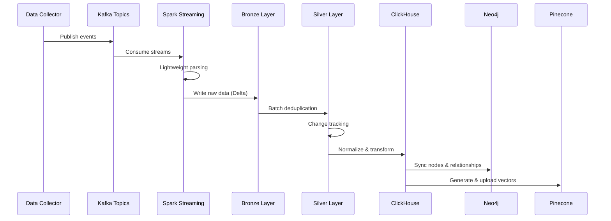

## Architecture Overview

The Entertainment Data Platform implements a **Medallion Architecture** pattern with three distinct layers: Bronze (raw), Silver (refined), and Gold (aggregated). This architecture ensures data quality, reliability, and efficient delivery to multiple downstream systems.


<Note>
  The platform processes entertainment data through a series of transformations, starting from raw Kafka streams and ending with specialized databases optimized for analytics, graph queries, and vector search.
</Note>

## System Components

The platform consists of several interconnected components working together to process and deliver data:

### 1. Data Collection & Simulation

<AccordionGroup>
  <Accordion title="Data Collector">
    The collector component crawls entertainment data from TMDB API, gathering information about:
    - **Movies**: Titles, overviews, release dates, ratings, cast, and crew
    - **TV Series**: Series information, seasons, episodes, and production details
    - **People**: Actors, directors, and crew members with biographies and filmographies
    
    Data is available on:
    - [Kaggle Dataset](https://www.kaggle.com/datasets/khoatm2k4/tmdb-craw-dataset)
    - [HuggingFace Dataset](https://huggingface.co/datasets/tmkhoa/tmdb-craw-dataset/tree/main)
  </Accordion>
  
  <Accordion title="Data Ingestion Service">
    The ingestion service simulates real-world streaming patterns by:
    - Loading entertainment records from local data files
    - Enriching records with metadata (timestamps, data types, labels)
    - Shuffling records with labels (`old`, `new`, `change`) to test system resilience
    - Publishing to Kafka topics with controlled throughput
    
    **Code Reference**: `src/ingestion/main.py:12-61`
    
    ```python
    # Key ingestion logic
    for record, data_type, data_label in iter_full(data_root_path):
        enriched_record = enrich_record(record, data_type, data_label)
        producer.send(topics[data_type], enriched_record)
        record_flush_buffer += 1
        
        if record_flush_buffer >= settings.kafka.producer.max_buffer:
            producer.flush()
            record_flush_buffer = 0
    ```
  </Accordion>
</AccordionGroup>

### 2. Stream Processing (Bronze Layer)

The stream processing layer consumes events from Kafka and performs initial validation before storing in the Bronze layer.

<Steps>
  <Step title="Kafka Stream Consumption">
    Spark Structured Streaming reads from three Kafka topics:
    - `movie` - Movie data stream
    - `tv_series` - TV series data stream  
    - `person` - People data stream
    
    **Code Reference**: `src/stream_processor/main.py:38-57`
    
    ```python
    builder = (
        SparkSession.builder \
            .appName("KafkaStreamToDelta") \
            .config("spark.sql.extensions", "io.delta.sql.DeltaSparkSessionExtension") \
            .config("spark.sql.catalog.spark_catalog", 
                    "org.apache.spark.sql.delta.catalog.DeltaCatalog") \
            .config("spark.databricks.delta.properties.defaults.enableChangeDataFeed", "true") \
            .config("spark.hadoop.fs.s3a.impl", "org.apache.hadoop.fs.s3a.S3AFileSystem") \
            .config("spark.hadoop.fs.s3a.endpoint", settings.sinks.delta_lake.minio_endpoint)
    )
    ```
  </Step>
  
  <Step title="Lightweight Parsing & Validation">
    The platform uses "Lightweight Parsing" to ensure high throughput:
    - **Critical Fields Only**: Validates only essential fields (data_type, id, timestamp)
    - **Schema Evolution Tolerance**: Handles unstable schemas gracefully
    - **Non-Blocking**: Invalid records don't halt the pipeline
    
    **Code Reference**: `src/stream_processor/processor/event_processor.py:30-49`
    
    ```python
    def valid_full_schema(df: DataFrame):
        """Check valid schema by adding boolean value to Column 'valid_schema'"""
        id_info = from_json(col("raw_df"), ID_SCHEMA)
        return df.withColumn("id_info", id_info) \
                    .withColumn(
                        "id_of_data_type",
                        coalesce(col("id_info.person_id"), 
                                col("id_info.movie_id"), 
                                col("id_info.tv_series_id"))
                    ) \
                    .withColumn(
                        "valid_schema",
                        col("data_type").isNotNull() &
                        col("data_label").isNotNull() &
                        col("timestamp").isNotNull() &
                        col("id_of_data_type").isNotNull()
                    )
    ```
  </Step>
  
  <Step title="Dead Letter Queue (DLQ)">
    Records failing validation are routed to a separate DLQ storage:
    - **No Pipeline Disruption**: Invalid records don't block processing
    - **Audit Trail**: Failed records are preserved for analysis
    - **Reprocessing**: DLQ records can be fixed and reprocessed
    - **Storage**: Separate Delta tables on MinIO for valid and invalid records
  </Step>
  
  <Step title="Bronze Layer Storage">
    Valid records are written to Delta Lake on MinIO:
    - **Immutable Storage**: Raw events preserved for auditing
    - **ACID Transactions**: Guarantees data consistency
    - **Change Data Feed**: Enabled for tracking modifications
    - **Partitioning**: Organized by data type for efficient queries
  </Step>
</Steps>

### 3. Batch Processing (Silver & Gold Layers)

Batch jobs orchestrated by Apache Airflow transform data through the Medallion layers:

<Tabs>
  <Tab title="Bronze → Silver">
    **Pipeline**: `batch_jobs.pipelines.bronze_silver.minio_to_minio`
    
    This critical transformation ensures data quality:
    
    #### Deduplication Strategy
    - Uses Delta Lake's ACID merge (upsert) operation
    - Key columns: `data_type`, `id_of_data_type`
    - Timestamp-based conflict resolution (latest wins)
    - Version tracking via Redis for incremental processing
    
    **Code Reference**: `src/batch_jobs/pipelines/bronze_silver/minio_to_minio.py:19-72`
    
    ```python
    # Version tracking for incremental processing
    version_key = f"{settings.storage.redis.keys.dedup_batch_version}_{data_type}"
    last_version = redis_client.get(version_key)
    
    delta_table = DeltaTable.forPath(spark, from_path)
    current_version = delta_table.history(1).select("version").collect()[0][0]
    
    # Read using Change Data Feed
    from_df = delta_minio_reader.read_table_cdf(
        target_path=from_path, 
        start_version=int(last_version), 
        end_version=current_version
    )
    
    # Upsert with timestamp-based merge
    upsert_latest(
        spark=spark, 
        from_df=from_df, 
        data_type=data_type,
        to_folder=to_path, 
        key_columns=key_columns, 
        ts_column=ts_column
    )
    ```
    
    #### Change Tracking
    The Silver layer computes hashes of relationship and embedding fields:
    - **Relationship Fields**: Cast and crew information
    - **Embedding Fields**: Overview and tagline for vectors
    - **Change Detection**: Compares hashes to identify modifications
    - **Optimization**: Only changed records sync to Neo4j/Pinecone
  </Tab>
  
  <Tab title="Silver → ClickHouse">
    **Pipeline**: `batch_jobs.pipelines.silver_silver.minio_to_clickhouse`
    
    Transforms Silver data into normalized ClickHouse tables:
    
    #### Table Schema
    The pipeline creates multiple normalized tables:
    - `movie` - Core movie information
    - `movie_cast` - Movie casting relationships
    - `movie_crew` - Movie crew relationships
    - `person` - People (actors, directors, crew)
    - `tv_series` - TV series information
    - `tv_series_cast` - TV series casting
    - `tv_series_crew` - TV series crew
    
    **Code Reference**: `src/batch_jobs/pipelines/silver_silver/minio_to_clickhouse.py:19-33`
    
    ```python
    TRANSFORM_MAP = {
        "movie": [
            {"table_name": "movie", "transform_func": prepare_table_movie},
            {"table_name": "movie_cast", "transform_func": prepare_table_movie_cast},
            {"table_name": "movie_crew", "transform_func": prepare_table_movie_crew},
        ],
        "person": [
            {"table_name": "person", "transform_func": prepare_table_person}
        ],
        "tv_series": [
            {"table_name": "tv_series", "transform_func": prepare_table_tv_series},
            {"table_name": "tv_series_cast", "transform_func": prepare_table_tv_series_cast},
            {"table_name": "tv_series_crew", "transform_func": prepare_table_tv_series_crew},
        ]
    }
    ```
    
    #### Write Strategy
    - **Native Protocol**: Uses ClickHouse native format for performance
    - **Batch Versioning**: Only processes records from latest batch
    - **Schema Initialization**: Automatically creates tables on first run
    - **Incremental Updates**: Redis-based version tracking
  </Tab>
  
  <Tab title="ClickHouse → Neo4j">
    **Pipeline**: `batch_jobs.pipelines.silver_gold.clickhouse_to_neo4j`
    
    Syncs graph data to Neo4j for relationship exploration:
    
    #### Node Creation
    Creates three node types with unique constraints:
    - **Movie** nodes (key: `movie_id`)
    - **Person** nodes (key: `person_id`)
    - **TV_Series** nodes (key: `tv_series_id`)
    
    #### Relationship Creation
    Establishes relationships between nodes:
    - **ACTED_IN**: Person → Movie/TV_Series (with character info)
    - **WORKS_ON**: Person → Movie/TV_Series (with role info)
    
    **Code Reference**: `src/batch_jobs/pipelines/silver_gold/clickhouse_to_neo4j.py:31-73`
    
    ```python
    "relationships": [
        {
            "ACTED_IN": {
                "tables": [["movie", "movie_cast"], ["tv_series", "tv_series_cast"]],
                "diff_col": ["casts_diff", "casts_diff"],
                "action_col": [["added", "removed"], ["added", "removed"]],
                "source_label": ["Person", "Person"],
                "target_label": ["Movie", "TV_Series"],
                "relationship_properties": [
                    ["cast_id", "character", "credit_id", 
                     "known_for_department", "batch_version"],
                    ...
                ]
            }
        }
    ]
    ```
    
    #### Change-Driven Sync
    Only records with detected changes are synced:
    - Reads `diff_col` from ClickHouse to identify modifications
    - Processes `added` and `removed` actions separately
    - Dramatically reduces Neo4j write operations
    - Minimizes API costs and latency
  </Tab>
  
  <Tab title="ClickHouse → Pinecone">
    **Pipeline**: `batch_jobs.pipelines.silver_gold.clickhouse_to_pinecone`
    
    Generates and stores vector embeddings for semantic search:
    
    #### Vector Generation
    - **Model**: `intfloat/e5-large-v2` (sentence transformers)
    - **Input Fields**: Combines `overview` and `tagline`
    - **Namespaces**: Separate for movies and tv_series
    - **Metadata**: Attached for filtering and retrieval
    
    **Code Reference**: `src/batch_jobs/pipelines/silver_gold/clickhouse_to_pinecone.py:13-26`
    
    ```python
    TRANSFORM_MAP = {
        "movie": {
            "id_col": "movie_id",
            "vector_prepare_cols": ["overview", "tagline"],
            "vector_col_name": "document",
            "metadata": "{}"
        },
        "tv_series": {
            "id_col": "tv_series_id",
            "vector_prepare_cols": ["overview", "tagline"],
            "vector_col_name": "document",
            "metadata": "{}"
        }
    }
    ```
    
    #### Use Cases
    - **Semantic Search**: Find similar movies/shows by meaning
    - **RAG Applications**: Provide context for LLM responses
    - **Recommendations**: Content-based similarity matching
    - **Discovery**: Explore entertainment content by themes
  </Tab>
</Tabs>

## Medallion Architecture Explained

The three-layer Medallion Architecture provides clear data quality guarantees:

<Steps>
  <Step title="Bronze Layer (Raw)">
    **Purpose**: Immutable landing zone for raw data
    
    Characteristics:
    - Stores raw JSON from Kafka exactly as received
    - No transformations applied
    - Enables auditing and compliance
    - Supports data replay and reprocessing
    - Change Data Feed enabled for tracking
    
    **Storage Format**: Delta Lake on MinIO
  </Step>
  
  <Step title="Silver Layer (Refined)">
    **Purpose**: Cleaned, deduplicated, single source of truth
    
    Characteristics:
    - Deduplicated using ACID merge operations
    - Parsed and validated schemas
    - Change tracking computed (hashes of key fields)
    - Batch versioning for incremental processing
    - Ready for business logic
    
    **Storage Format**: Delta Lake on MinIO
  </Step>
  
  <Step title="Gold Layer (Aggregated)">
    **Purpose**: Business-ready data in specialized systems
    
    Characteristics:
    - Optimized for specific query patterns
    - Multiple specialized databases:
      - **ClickHouse**: Fast aggregations and analytics
      - **Neo4j**: Graph traversal and relationships
      - **Pinecone**: Vector similarity and semantic search
    - Only changed records synced (efficiency)
    
    **Storage Format**: Multiple specialized databases
  </Step>
</Steps>

## Data Flow

The complete data journey through the platform:



## Integration Points

### Apache Kafka
- **Version**: Latest (KRaft mode)
- **Topics**: 3 topics (movie, tv_series, person)
- **Partitions**: 3 per topic
- **Retention**: 9,000,000 ms (~2.5 hours)
- **Port**: 9092 (external), 29092 (internal)

### MinIO Object Storage
- **Port**: 9000 (API), 9001 (Console)
- **Credentials**: minio / minio123
- **Buckets**: Organized by layer (bronze, silver)
- **Format**: Delta Lake tables with Parquet files

### ClickHouse
- **Port**: 8123 (HTTP), 9002 (Native)
- **Tables**: 7 normalized tables
- **Engine**: MergeTree family
- **Interface**: Tabix web UI on port 8081

### Redis
- **Port**: 6379
- **Purpose**: Batch version tracking
- **Keys**: `dedup_batch_version_{data_type}`
- **Type**: Simple key-value storage

### Neo4j
- **Node Types**: Movie, Person, TV_Series
- **Relationships**: ACTED_IN, WORKS_ON
- **Connector**: Neo4j Spark Connector
- **Write Mode**: Batch with change detection

### Pinecone
- **Embedding Model**: intfloat/e5-large-v2
- **Dimensions**: 1024 (from model)
- **Namespaces**: movie, tv_series
- **Metadata**: ID and source fields

## Deployment Architecture

The platform supports multiple deployment modes:

<Tabs>
  <Tab title="Local Development">
    **Docker Compose** setup for rapid development:
    
    ```yaml
    # deployment/docker/docker_compose.yml
    services:
      broker1:        # Kafka broker
      minio:          # Object storage
      clickhouse:     # Analytics DB
      tabix:          # ClickHouse UI
      redis:          # Version tracking
    ```
    
    All services run on localhost with exposed ports.
  </Tab>
  
  <Tab title="Production (Kubernetes)">
    **Kubernetes** manifests for production scale:
    
    - Separate namespaces for isolation
    - StatefulSets for stateful services
    - Persistent volumes for data
    - Service mesh for networking
    - Horizontal pod autoscaling
    - Resource limits and requests
    
    Location: `deployment/k8s/`
  </Tab>
</Tabs>

## Performance Optimizations

<CardGroup cols={2}>
  <Card title="Change-Driven Sync" icon="arrows-rotate">
    Only records with actual changes are synced to Neo4j and Pinecone, reducing writes by up to 90%
  </Card>
  
  <Card title="Batch Versioning" icon="code-branch">
    Redis-tracked versions enable incremental processing, avoiding full table scans
  </Card>
  
  <Card title="Native Protocols" icon="bolt">
    ClickHouse native format provides 10x faster writes than JDBC
  </Card>
  
  <Card title="Delta Lake CDF" icon="timeline">
    Change Data Feed reads only modifications between versions
  </Card>
  
  <Card title="Partitioning" icon="table-columns">
    Data partitioned by type for parallel processing
  </Card>
  
  <Card title="Lightweight Parsing" icon="feather">
    Validates only critical fields for maximum throughput
  </Card>
</CardGroup>

## Monitoring & Observability

Key metrics to monitor:

- **Kafka**: Consumer lag, throughput, partition balance
- **Spark**: Batch processing time, record counts, memory usage
- **Delta Lake**: Table versions, CDF progress, file counts
- **ClickHouse**: Query performance, table sizes, merge operations
- **Redis**: Batch version consistency, connection pool
- **Neo4j**: Node/relationship counts, write latency
- **Pinecone**: Vector index size, query latency

<Tip>
  Add logging configurations in `src/common/logging_config.py` to customize log levels and output formats.
</Tip>