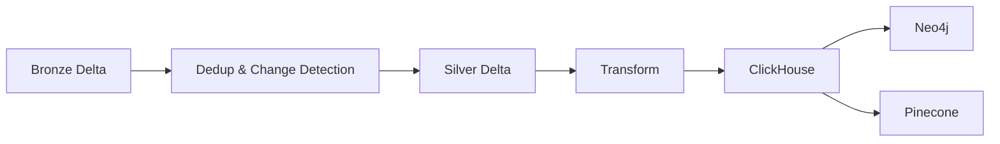
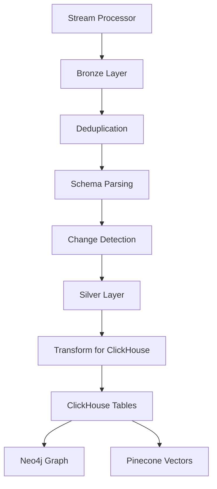

## Overview

The Batch Jobs module contains scheduled data pipelines responsible for transforming and moving data across storage and serving layers. It orchestrates the transition from **Bronze → Silver → Gold** and integrates analytical and serving systems.

This component ensures data quality, consistency, and availability across the entire data platform.

## Processing Overview

There are **4 main tasks** executed in this module:

<Steps>
  <Step title="Bronze → Silver (Delta Lake)">
    Parse full schema, detect changes, and deduplicate records using timestamp
  </Step>

  <Step title="Silver → ClickHouse">
    Transform and load structured data into analytical tables
  </Step>

  <Step title="ClickHouse → Neo4j">
    Build graph relationships for entity connections
  </Step>

  <Step title="ClickHouse → Pinecone">
    Generate and store embeddings for semantic retrieval
  </Step>
</Steps>

## Module Structure

```text
batch_jobs/
├── config/        # Pipeline & environment configuration
├── dags/          # Airflow DAG definitions
├── io/            # Database & storage readers/writers
├── pipelines/     # Main pipeline entrypoints
├── run_time/      # Runtime helpers & context
├── schema/        # Full bronze-layer schemas
├── script/        # Setup scripts (e.g., create ClickHouse tables)
├── transforms/    # Data transformation logic
├── __init__.py
├── Dockerfile
└── README.md
```

## Components

### 1. IO

Contains abstractions for interacting with external systems.

<Accordion title="IO Layer Examples">
**Readers**:
- Delta Lake reader for Bronze/Silver layers
- ClickHouse reader for analytical queries

**Writers**:
- Delta Lake writer with ACID support
- ClickHouse writer (JDBC and native protocols)
- Neo4j writer for graph data
- Pinecone client for vector embeddings
</Accordion>

This layer isolates storage logic from pipeline logic, making the system more maintainable and testable.

### 2. Schema

Defines the **full schema** of records stored in the Bronze layer.

<Note>
  Unlike the stream processor (which only parses critical fields), batch jobs operate on complete records for correctness and consistency.
</Note>

Schema modules include:
- `movie_schema.py` - Complete movie data structure
- `tv_series_schema.py` - Complete TV series data structure
- `person_schema.py` - Complete person data structure
- `diff_schema.py` - Change detection metadata
- `vector_df_schema.py` - Vector embedding structure

### 3. Transforms

Responsible for transforming data between source and destination.

**Position in flow**: Reader → Transform → Writer

<AccordionGroup>
  <Accordion title="Delta to Delta Transforms">
    Located in `transforms/delta_delta/`:
    
    - **parse_schema.py** - Parse raw JSON into structured format
    - **upsert_latest.py** - Deduplicate and upsert latest records
    - **hash_column.py** - Generate hashes for change detection
  </Accordion>

  <Accordion title="Delta to ClickHouse Transforms">
    Located in `transforms/delta_clickhouse/`:
    
    - **prepare_clickhouse_table.py** - Transform Delta records for ClickHouse insertion
    - Handles denormalization and flattening of nested structures
  </Accordion>

  <Accordion title="ClickHouse to Neo4j Transforms">
    Located in `transforms/clickhouse_neo4j/`:
    
    - **join_relationship.py** - Build graph relationships between entities
  </Accordion>

  <Accordion title="ClickHouse to Pinecone Transforms">
    Located in `transforms/clickhouse_pinecone/`:
    
    - **prepare_vector_df.py** - Prepare text for embedding generation
  </Accordion>
</AccordionGroup>

**Typical operations**:
- Change detection
- Deduplication
- Field normalization
- Aggregation

### 4. Script

Contains setup utilities required before running pipelines.

**Example**: Create ClickHouse tables before loading data.

These scripts ensure that the target systems are properly initialized before data transformation begins.

### 5. Pipelines

Contains the main functions invoked by Airflow orchestration.

<Accordion title="Bronze to Silver Pipeline">
```python batch_jobs/pipelines/bronze_silver/minio_to_minio.py
def run_dedup_timestamp():
    """
    Pipeline to dedup timestamp, from bronze to silver layer in Delta Lake Minio
    """
    setup_logging()
    settings = load_settings()
    redis_client = RedisClient()
    
    builder = create_spark_minio(app_name=settings.spark.app_name_1, settings=settings)
    spark = builder.getOrCreate()
    delta_minio_reader = DeltaMinioReader(spark)
    
    data_struct_schema = {
        "movie": MOVIE_FULL_SCHEMA,
        "tv_series": TV_SERIES_FULL_SCHEMA,
        "person": PERSON_FULL_SCHEMA
    }
    
    for data_type, target_folder in settings.storage.delta_lake.target_name_folder:
        # Get batch version from Redis
        version_key = f"{settings.storage.redis.keys.dedup_batch_version}_{data_type}"
        last_version = redis_client.get(version_key) or 0
        
        # Read incremental changes
        delta_table = DeltaTable.forPath(spark, from_path)
        current_version = delta_table.history(1).select("version").collect()[0][0]
        from_df = delta_minio_reader.read_table_cdf(
            target_path=from_path, 
            start_version=int(last_version), 
            end_version=current_version
        )
        
        # Upsert to Silver layer
        upsert_latest(
            spark=spark, 
            from_df=from_df, 
            data_type=data_type, 
            data_schema=data_struct_schema[data_type], 
            to_folder=to_path
        )
        
        # Update version in Redis
        redis_client.set(version_key, current_version)
```
</Accordion>

<Accordion title="Upsert Latest Transform">
```python batch_jobs/transforms/delta_delta/upsert_latest.py
def upsert_latest(
        spark: SparkSession,
        from_df: DataFrame,
        data_type: str,
        raw_column: str,
        data_schema,
        to_folder: str,
        key_columns: list[str],
        ts_column: str
):
    """
    Upsert latest batch to Delta Lake, from Bronze to Silver Layer
    """
    # Deduplicate within batch
    clean_df = dedup_latest_batch(from_df, key_columns, ts_column)
    
    # Parse schema and compute hashes
    parsed_df = parse_schema(df=clean_df, col=raw_column, schema=data_schema)
    hashed_df = full_hash_and_pre_diff_columns(parsed_df, HASH_CONFIGS[data_type])
    
    # Initialize table if needed
    if not DeltaTable.isDeltaTable(spark, to_folder):
        hashed_df.limit(0).write.format("delta").mode("overwrite").save(to_folder)
    
    # Merge with change detection
    target_delta_table = DeltaTable.forPath(spark, to_folder)
    final_source_df = get_full_diff_by_hash(
        source_df=hashed_df,
        target_df=target_delta_table.toDF(),
        key_columns=key_columns
    )
    
    merge_condition = " AND ".join([f"t.{col} = s.{col}" for col in key_columns])
    update_condition = f"s.{ts_column} > t.{ts_column}"
    
    (target_delta_table.alias("t")
        .merge(source=final_source_df.alias("s"), condition=merge_condition)
        .whenMatchedUpdateAll(condition=update_condition)
        .whenNotMatchedInsertAll()
        .execute()
    )
```

def dedup_latest_batch(
        df: DataFrame,
        key_columns: list[str],
        ts_column: str
):
    """
    Deduplicate DataFrame by latest timestamp
    """
    window = Window.partitionBy(*key_columns).orderBy(col(ts_column).desc())
    return df.withColumn("row_number", row_number().over(window)) \
             .filter(col("row_number") == 1) \
             .drop("row_number")
```
</Accordion>

**Responsibilities**:
- Load configuration
- Initialize IO clients
- Execute transforms
- Trigger write operations

**Example entrypoints**:
- `bronze_silver/minio_to_minio.py` - Bronze → Silver transformation
- `silver_silver/minio_to_clickhouse.py` - Silver → ClickHouse loading
- `silver_gold/clickhouse_to_neo4j.py` - ClickHouse → Neo4j graph building
- `silver_gold/clickhouse_to_pinecone.py` - ClickHouse → Pinecone embedding generation

### 6. DAGs

Airflow orchestration layer for scheduling and monitoring batch jobs.

<Note>
  DAGs must be mounted into the Airflow `dags_folder` to be detected and executed.
</Note>

Two types of DAGs:

1. **Standard DAG** - For local or VM deployments
2. **KubernetesPodOperator DAG** - For running jobs on Kubernetes clusters

<Accordion title="DAG Structure (Commented)">
```python batch_jobs/dags/batch_jobs.py
def full_batch_jobs():
    
    @task()
    def job_dedup_timestamp() -> None:
        run_dedup_timestamp()
    
    @task()
    def job_extract_to_clickhouse():
        write_minio_to_clickhouse()
    
    @task()
    def job_write_to_neo4j():
        write_clickhouse_to_neo4j()
    
    @task()
    def job_write_to_pinecone():
        write_clickhouse_to_pinecone()
    
    job_dedup_timestamp() >> job_extract_to_clickhouse() >> \
        job_write_to_neo4j() >> job_write_to_pinecone()
```
</Accordion>

## Configuration

### Settings Structure

<Accordion title="Configuration Schema">
```python batch_jobs/config/settings.py
class DeltaLakeSettings(BaseModel):
    minio_endpoint: str
    minio_access_key: str
    minio_secret_key: str
    target_name_folder: DeltaLakeTargetNameFolderSettings
    tables: DeltaLakeTablesSettings

class ClickhouseSettings(BaseModel):
    host: str
    port: int
    username: str
    password: str
    database: str
    jdbc_driver: str
    native_driver: str

class RedisSettings(BaseModel):
    host: str
    port: int
    keys: RedisKeySettings

class Neo4jSettings(BaseModel):
    url: str
    username: str
    password: str
    database: str
    batch_size: int

class PineconeSettings(BaseModel):
    api_key: str
    index_name: str
    namespace: PineconeNamespaceSettings

class StorageSettings(BaseModel):
    delta_lake: DeltaLakeSettings
    clickhouse: ClickhouseSettings
    redis: RedisSettings
    neo4j: Neo4jSettings
    pinecone: PineconeSettings
```
</Accordion>

### Environment Variables

Sensitive credentials are loaded from environment variables:

```bash
# Neo4j
NEO4J_URI=neo4j+s://xxx.databases.neo4j.io
NEO4J_USERNAME=neo4j
NEO4J_PASSWORD=xxx
NEO4J_DATABASE=neo4j
AURA_INSTANCEID=xxx
AURA_INSTANCENAME=xxx

# Pinecone
PINECONE_API_KEY=xxx
PINECONE_INDEX_NAME=entertainment-embeddings
```

## Execution Flow



## Usage

### Manual Execution (Without Airflow)

For quick testing, you can run pipelines manually in order:

<Steps>
  <Step title="Bronze to Silver">
    ```bash
    python -m batch_jobs.pipelines.bronze_silver.minio_to_minio
    ```
    Deduplicates records and detects changes
  </Step>

  <Step title="Silver to ClickHouse">
    ```bash
    python -m batch_jobs.pipelines.silver_silver.minio_to_clickhouse
    ```
    Loads analytical tables
  </Step>

  <Step title="ClickHouse to Neo4j">
    ```bash
    python -m batch_jobs.pipelines.silver_gold.clickhouse_to_neo4j
    ```
    Builds graph relationships
  </Step>

  <Step title="ClickHouse to Pinecone">
    ```bash
    python -m batch_jobs.pipelines.silver_gold.clickhouse_to_pinecone
    ```
    Generates and stores embeddings
  </Step>
</Steps>

### Airflow Orchestration (Production)

<Steps>
  <Step title="Mount DAGs">
    Copy DAG files from `batch_jobs/dags/` to your Airflow `dags_folder`
  </Step>

  <Step title="Configure Connections">
    Set up Airflow connections for:
    - MinIO/S3
    - ClickHouse
    - Neo4j
    - Pinecone
    - Redis
  </Step>

  <Step title="Trigger DAG">
    Enable and trigger the `full_batch_jobs` DAG from the Airflow UI
  </Step>
</Steps>

## Data Flow



## Integration with Other Components

<AccordionGroup>
  <Accordion title="Stream Processor Module">
    Reads data from the Bronze layer created by the [Stream Processor](/components/stream-processor) module.
  </Accordion>

  <Accordion title="State Management with Redis">
    Uses Redis to track batch versions and maintain processing state across pipeline runs. This enables incremental processing and prevents reprocessing of unchanged data.
  </Accordion>

  <Accordion title="Change Data Feed (CDF)">
    Leverages Delta Lake's Change Data Feed feature to efficiently process only changed records between batch runs.
  </Accordion>
</AccordionGroup>

## Best Practices

<CardGroup cols={2}>
  <Card title="Incremental Processing" icon="forward">
    Use Delta Lake CDF and Redis version tracking to process only new/changed data, dramatically reducing processing time.
  </Card>
  
  <Card title="Idempotency" icon="rotate">
    Design pipelines to be idempotent. Re-running the same batch should produce the same results without side effects.
  </Card>
  
  <Card title="Schema Evolution" icon="diagram-project">
    Use Delta Lake's schema evolution capabilities to handle changes in data structure over time.
  </Card>
  
  <Card title="Monitoring" icon="chart-line">
    Track key metrics: records processed, processing time, error rates, and data quality issues.
  </Card>
</CardGroup>

## Performance Optimization

<Accordion title="Spark Tuning">
  - Adjust executor memory and cores based on data volume
  - Use appropriate partition counts for optimal parallelism
  - Enable adaptive query execution for dynamic optimization
</Accordion>

<Accordion title="Delta Lake Optimization">
  - Run OPTIMIZE commands periodically to compact small files
  - Use Z-ORDER clustering for frequently queried columns
  - Vacuum old versions to reclaim storage space
</Accordion>

<Accordion title="Batch Sizing">
  - Balance batch size between throughput and latency
  - Larger batches improve throughput but increase end-to-end latency
  - Monitor queue depths and adjust batch intervals accordingly
</Accordion>

## Troubleshooting

<Accordion title="Version Mismatch Errors">
  If Redis version tracking gets out of sync, manually reset the version keys or perform a full reprocessing from version 0.
</Accordion>

<Accordion title="Schema Parse Failures">
  Check that Bronze layer data matches the expected schema. Invalid data should have been caught in the Stream Processor DLQ.
</Accordion>

<Accordion title="ClickHouse Write Failures">
  Verify ClickHouse table schemas match the transform output. Run initialization scripts to ensure tables exist.
</Accordion>

<Accordion title="Memory Errors">
  Increase Spark executor memory or reduce batch size. Consider processing data in smaller chunks.
</Accordion>

<Accordion title="Neo4j Timeout Errors">
  Adjust batch size for Neo4j writes. Large batches may timeout on slower networks or constrained instances.
</Accordion>

## Notes

<Note>
  - Designed for scheduled execution via Airflow
  - Supports both local and Kubernetes deployments
  - Ensures data consistency across analytical and serving layers
  - Works together with Stream Processor outputs to maintain data freshness
</Note>
