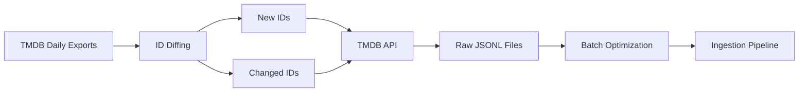

## Overview

The Collector module is responsible for fetching raw entertainment data (Movies, TV Series, and People) from the **TMDB API**. It uses a sophisticated ID-tracking mechanism to differentiate between existing, new, and updated records.

This component serves as the entry point for the entire data pipeline, ensuring efficient and incremental data collection from TMDB.

## Module Structure

```text
collector/
├── craw_api/             # Core crawling logic using TMDB API
│   └── tmdb/
│       ├── .env          # API credentials
│       ├── craw_movie.ipynb
│       ├── craw_person.ipynb
│       └── craw_tv_series.ipynb
├── data/                 # Raw storage for crawled records
│   ├── id_list/          # ID lists (JSONL) from TMDB daily exports
│   ├── movie/            # Raw JSONL for Movies
│   ├── person/           # Raw JSONL for People
│   └── tv_series/        # Raw JSONL for TV Series
├── util/                 # Data processing utilities
│   ├── extract_new_id.ipynb    # Logic to identify NEW and CHANGED IDs
│   └── convert_into_batch.ipynb # Re-batching logic for Kaggle optimization
└── README.md
```

## How It Works

The Collector leverages TMDB Daily ID Exports (files provided by TMDB containing all valid IDs up to a specific date) to manage incremental updates efficiently.

<Steps>
  <Step title="ID Diffing & Versioning">
    The system tracks changes by comparing two snapshots of TMDB ID lists:
    
    - **Baseline**: All IDs from the first snapshot (e.g., Dec 2025) are crawled and stored as "Old Data"
    - **Extraction**: The `util/extract_new_id.ipynb` script performs a comparison to determine:
      - **New IDs**: IDs added to TMDB after the baseline date
      - **Changed IDs**: Existing IDs that require a re-crawl to capture metadata updates
  </Step>

  <Step title="Crawling Process">
    The notebooks in `craw_api/tmdb/` read the IDs identified from `data/id_list/`. They fetch full details (metadata, credits, etc.) from the TMDB API and save them as JSONL files in the corresponding `data/` sub-folders.
  </Step>

  <Step title="Batch Optimization">
    Due to the large volume of records, crawling is often offloaded to Kaggle. Different crawl sessions may produce JSONL files with inconsistent record counts per file.
    
    The solution: `util/convert_into_batch.ipynb` loads these irregular files and redistributes the records into uniform, balanced batches. This ensures high throughput and stability when the data is eventually pushed to the Spark processing pipeline.
  </Step>
</Steps>

<Note>
  **Pre-crawled Datasets**: If you prefer to skip the crawling process, you can access ready-to-use data on [Kaggle](https://www.kaggle.com/datasets/khoatm2k4/tmdb-craw-dataset) or [HuggingFace](https://huggingface.co/datasets/tmkhoa/tmdb-craw-dataset/tree/main).
</Note>

## Configuration

### API Credentials

Create a `.env` file in `craw_api/tmdb/`:

```bash
MDB_API_KEY_MOVIE=your_movie_api_key
TMDB_API_KEY_TV_SERIES=your_tv_series_api_key
TMDB_API_KEY_PERSON=your_person_api_key
```

<Warning>
  Keep your API keys secure and never commit them to version control.
</Warning>

## Usage

### Running the Crawler

<Steps>
  <Step title="Setup API Keys">
    Create a `.env` file in `craw_api/tmdb/` with your TMDB API credentials.
  </Step>

  <Step title="Execute Notebooks">
    Open the notebooks in `craw_api/tmdb/` and execute cells sequentially:
    - `craw_movie.ipynb` - Crawl movie data
    - `craw_tv_series.ipynb` - Crawl TV series data
    - `craw_person.ipynb` - Crawl person data
  </Step>

  <Step title="Identify Deltas">
    Use `util/extract_new_id.ipynb` to compare ID lists and extract new/changed IDs for incremental updates.
  </Step>

  <Step title="Optimize Batches (Optional)">
    If crawling on Kaggle or with multiple workers, use `util/convert_into_batch.ipynb` to redistribute records into uniform batches.
  </Step>
</Steps>

## Data Flow



## Integration with Other Components

<AccordionGroup>
  <Accordion title="Ingestion Module">
    The Collector outputs raw JSONL files that are consumed by the [Ingestion](/components/ingestion) module. The Ingestion module reads these files, enriches them with metadata, and publishes events to Kafka for downstream processing.
  </Accordion>

  <Accordion title="Data Organization">
    Data is organized by:
    - **Type**: `movie`, `tv_series`, `person`
    - **Label**: `old`, `new`, `change`
    
    This structure enables the Ingestion module to simulate realistic streaming patterns with mixed data types and update states.
  </Accordion>
</AccordionGroup>

## Best Practices

<CardGroup cols={2}>
  <Card title="Incremental Updates" icon="rotate">
    Use ID diffing to only crawl new and changed records, reducing API calls and processing time.
  </Card>
  
  <Card title="Rate Limiting" icon="gauge-high">
    Respect TMDB API rate limits by implementing appropriate delays between requests.
  </Card>
  
  <Card title="Error Handling" icon="triangle-exclamation">
    Log failed requests and implement retry logic for transient errors.
  </Card>
  
  <Card title="Data Validation" icon="check-double">
    Validate crawled data before saving to ensure data quality and completeness.
  </Card>
</CardGroup>

## Troubleshooting

<Accordion title="API Authentication Errors">
  Ensure your API keys are correctly set in the `.env` file and have the necessary permissions.
</Accordion>

<Accordion title="Rate Limit Exceeded">
  Implement exponential backoff and respect TMDB's rate limits. Consider spreading requests over time.
</Accordion>

<Accordion title="Missing IDs in Comparison">
  Verify that both baseline and current ID export files are present in `data/id_list/`.
</Accordion>
