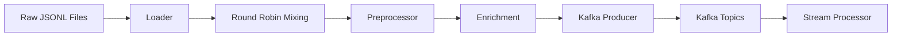

## Overview

The Ingestion module simulates a streaming ingestion pipeline that reads raw data produced by the Collector, enriches it with metadata, and publishes events to Kafka. The goal is to mimic real-time data flow where different data types and update states are processed together.

This component bridges the gap between static data collection and real-time stream processing.

## Module Structure

```text
ingestion/
├── config/              # Kafka & pipeline configs
├── data/
│   ├── movie/           # Example structure (expanded)
│   │   ├── new/
│   │   ├── change/
│   │   └── old/
│   ├── tv_series/       # Same structure as movie
│   └── person/          # Same structure as movie
├── loader/              # Load & mix data into a simulated stream
├── preprocessor/        # Data enrichment & normalization
├── producer/            # Kafka producer logic
├── __init__.py
├── main.py              # Entry point
├── Dockerfile
└── README.md
```

## Streaming Concept

Instead of sending a single batch, the pipeline mixes records from:

- **Data Types**: `movie`, `tv_series`, `person`
- **Data Labels**: `new`, `change`, `old`

This simulates how real systems receive heterogeneous updates continuously, providing a realistic testing environment for downstream processors.

## Components

### 1. Loader

The Loader is responsible for reading raw JSONL files from the `data/` directory and creating a unified event stream.

<Accordion title="Loader Implementation">
```python ingestion/loader/file_loader.py
DATA_TYPES = ["movie", "tv_series", "person"]
DATA_LABELS = ["old", "new", "change"]

def iter_records_from_file(file_path: Path):
    """
    Load and yield records from file
    """
    with open(file_path, "r", encoding="utf-8") as f:
        for line_number, line in enumerate(f, start=1):
            line = line.strip()
            if line:
                try:
                    yield json.loads(line)
                except Exception as e:
                    logger.error("Error when load record %d in file %s", 
                                line_number, file_path)

def iter_full(data_root_path: Path):
    """
    Round robin iterator to load mix data from all data folders
    """
    streams = []
    for data_type in DATA_TYPES:
        for data_label in DATA_LABELS:
            stream = iter_records_from_folder(data_root_path, data_type, data_label)
            streams.append((stream, data_type, data_label))
    
    q = deque([(iter(stream), data_type, data_label) 
               for stream, data_type, data_label in streams])
    
    while q:
        try:
            stream, data_type, data_label = q.popleft()
            value = next(stream)
            yield value, data_type, data_label
            q.append((stream, data_type, data_label))
        except StopIteration:
            pass
```
</Accordion>

**Behavior**:
- Iterates across all data types and labels
- Uses round-robin strategy to mix records
- Emits a unified stream of events

**Purpose**: Simulate a real event stream instead of static batch input.

### 2. Preprocessor

The Preprocessor enriches and standardizes events before publishing to Kafka.

<Accordion title="Preprocessor Implementation">
```python ingestion/preprocessor/record_processor.py
def enrich_record(
        record: dict,
        data_type: str,
        data_label: str
) -> dict:
    """
    Add metadata to record
    """
    enriched_record = record.copy()
    enriched_record["data_type"] = data_type
    enriched_record["data_label"] = data_label
    
    if data_label == "old":
        start = datetime(2025, 1, 1, tzinfo=timezone.utc)
        end = datetime(2025, 12, 31, 23, 59, 59, tzinfo=timezone.utc)
    elif data_label in ["new", "change"]:
        start = datetime(2026, 1, 1, tzinfo=timezone.utc)
        end = datetime(2026, 2, 20, 23, 59, 59, tzinfo=timezone.utc)
    
    enriched_record["timestamp"] = get_random_timestamp(start, end)
    
    return enriched_record
```
</Accordion>

**Typical transformations**:
- Add ingestion metadata (`data_type`, `data_label`)
- Update processing timestamp
- Minor cleaning and validation

### 3. Producer

The Producer publishes processed events to Kafka topics.

<Accordion title="Producer Implementation">
```python ingestion/producer/kafka_producer.py
class KafkaProducerService:
    """
    Kafka producer wrapper.
    """
    def __init__(self, settings: Settings):
        self.settings = settings
        conf = {
            'bootstrap.servers': settings.kafka.server.bootstrap_servers,
            'client.id': socket.gethostname(),
            'retries': settings.kafka.producer.retries
        }
        self.producer = Producer(conf)
    
    def send(self, topic, value):
        """
        Send records to kafka topic.
        """
        try:
            payload = json.dumps(value, ensure_ascii=False).encode('utf-8')
            key = str(random.randint(0, 10)).encode('utf-8')
            
            self.producer.produce(
                topic=topic,
                value=payload,
                callback=self._acked,
                key=key
            )
            self.producer.poll(0)
        except BufferError:
            logger.error("Kafka buffer is full, waiting")
            self.producer.poll(1)
    
    def flush(self):
        """
        Flush all records in buffer
        """
        self.producer.flush()
```
</Accordion>

**Responsibilities**:
- Serialize events to JSON
- Assign event key (for partitioning)
- Send to topic based on data type
- Handle delivery callbacks and retries

## Configuration

### Settings Structure

<CodeGroup>
```python ingestion/config/settings.py
class TopicSettings(BaseModel):
    movie: str
    tv_series: str
    person: str

class KafkaServerSettings(BaseModel):
    bootstrap_servers: str

class ProducerSettings(BaseModel):
    retries: int
    max_buffer: int

class KafkaSettings(BaseModel):
    topics: TopicSettings
    server: KafkaServerSettings
    producer: ProducerSettings

class Settings(BaseModel):
    kafka: KafkaSettings
```

```yaml config.dev.yml
kafka:
  topics:
    movie: "tmdb_movie"
    tv_series: "tmdb_tv_series"
    person: "tmdb_person"
  server:
    bootstrap_servers: "localhost:9092"
  producer:
    retries: 3
    max_buffer: 1000
```
</CodeGroup>

### Environment Variables

Set `APP_ENV` to load the appropriate configuration:

```bash
export APP_ENV=dev  # Loads config.dev.yml
export APP_ENV=prod # Loads config.prod.yml
```

## Usage

### Running the Pipeline

<Steps>
  <Step title="Prepare Environment">
    Update configs in `config/` with your Kafka bootstrap servers and topic names.
  </Step>

  <Step title="Set Python Path">
    Export the source directory to Python path:
    ```bash
    export PYTHONPATH=$(pwd)/src
    ```
  </Step>

  <Step title="Run the Pipeline">
    Execute the main module:
    ```bash
    python -m ingestion.main
    ```
  </Step>
</Steps>

### Main Pipeline Flow

<Accordion title="Main Pipeline Implementation">
```python ingestion/main.py
def main():
    setup_logging()
    logger = logging.getLogger(__name__)
    logger.info("Ingestion service starting...")
    
    # Load config
    settings = load_settings()
    
    # Init Kafka Producer
    producer = KafkaProducerService(settings)
    data_root_path = Path(__file__).resolve().parent / "data"
    topics = {
        "movie": settings.kafka.topics.movie,
        "tv_series": settings.kafka.topics.tv_series,
        "person": settings.kafka.topics.person
    }
    
    # Main logic
    record_flush_buffer = 0
    total_record_count = 0
    for record, data_type, data_label in iter_full(data_root_path):
        # Enrich record
        enriched_record = enrich_record(record, data_type, data_label)
        
        # Send record to kafka
        producer.send(topics[data_type], enriched_record)
        record_flush_buffer += 1
        total_record_count += 1
        
        # Flush
        if record_flush_buffer >= settings.kafka.producer.max_buffer:
            producer.flush()
            record_flush_buffer = 0
            time.sleep(1)
```
</Accordion>

The pipeline will:
1. Load mixed records from all data folders
2. Enrich events with metadata and timestamps
3. Produce messages to Kafka topics
4. Flush buffers periodically

## Data Flow



## Integration with Other Components

<AccordionGroup>
  <Accordion title="Collector Module">
    Reads raw data files produced by the [Collector](/components/collector) module from the `data/` directory.
  </Accordion>

  <Accordion title="Stream Processor Module">
    Publishes enriched events to Kafka topics that are consumed by the [Stream Processor](/components/stream-processor) module for real-time processing.
  </Accordion>
</AccordionGroup>

## Performance Considerations

<CardGroup cols={2}>
  <Card title="Buffering" icon="layer-group">
    Configure `max_buffer` to balance throughput and memory usage. Larger buffers improve throughput but increase memory consumption.
  </Card>
  
  <Card title="Batch Flushing" icon="gauge-high">
    Adjust flush frequency based on your latency requirements. More frequent flushes reduce latency but may decrease throughput.
  </Card>
  
  <Card title="Partitioning" icon="chart-network">
    Use meaningful partition keys to ensure even distribution across Kafka partitions.
  </Card>
  
  <Card title="Error Handling" icon="shield-check">
    Implement proper error handling and logging to track failed records without stopping the pipeline.
  </Card>
</CardGroup>

## Monitoring

<Note>
  The pipeline logs progress at regular intervals, including:
  - Total records processed
  - Successful deliveries
  - Failed deliveries with error details
  - Buffer flush events
</Note>

## Troubleshooting

<Accordion title="Connection Errors">
  Verify that Kafka is running and accessible at the configured `bootstrap_servers` address.
</Accordion>

<Accordion title="Buffer Full Errors">
  Increase the `max_buffer` setting or implement more frequent flushing to prevent buffer overflow.
</Accordion>

<Accordion title="Serialization Errors">
  Check that all records contain valid JSON-serializable data. Non-serializable objects will cause errors.
</Accordion>
