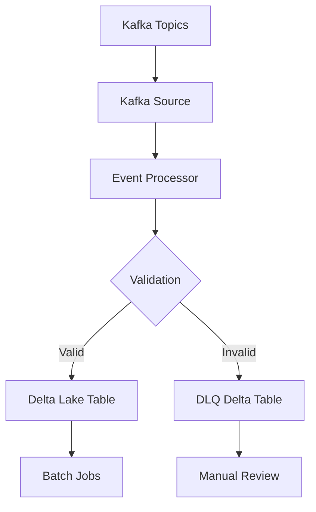

## Overview

The Stream Processor module consumes streaming events from Kafka, processes them in real-time, and writes structured data into Delta tables stored on MinIO. A key design principle is **fault tolerance**: records that fail parsing will NOT stop the pipeline. Instead, they are redirected to a **Dead Letter Queue (DLQ)** stored in Delta on MinIO, ensuring no data loss.

This component provides the bridge between real-time data ingestion and structured data storage.

## High-Level Flow

```
Kafka → Source → Processor → Delta Sink (MinIO)
                      ↓
             If parsing fails
                      ↓
           DLQ Delta Table (MinIO)
```

## Module Structure

```text
stream_processor/
├── config/        # Runtime & pipeline configuration
├── processor/     # Core transformation logic
├── runtime/       # Client wrappers (MinIO, configs, shared context)
├── schema/        # Lightweight schemas for parsing
├── sinks/         # Output writers (Delta on MinIO)
├── sources/       # Kafka ingestion logic
├── __init__.py
├── main.py        # Entry point
├── Dockerfile
└── README.md
```

## Core Concepts

### Delta Lake on MinIO

Processed records are stored as Delta tables on MinIO, enabling:

- **ACID transactions** - Ensure data consistency
- **Schema evolution** - Handle changing data structures
- **Efficient queries** - Support both batch and analytics workloads
- **Time travel** - Query historical versions of data

### Dead Letter Queue (DLQ)

Streaming systems must never stop because of bad records. The DLQ pattern ensures resilience and data integrity.

<Note>
  If an event fails schema parsing, has missing required fields, or contains corrupted JSON, it will be written to a **DLQ Delta table** on MinIO instead of breaking the pipeline.
</Note>

This guarantees:
- **No data loss** - Every record is preserved
- **Easier debugging** - Failed records can be inspected and replayed
- **Stable operations** - Long-running streaming jobs remain healthy

## Components

### 1. Sources

Handles Kafka consumption and stream creation.

<Accordion title="Kafka Source Implementation">
```python stream_processor/sources/kafka_source.py
def read_kafka_stream(
        spark: SparkSession,
        settings: Settings,
        topic: str
) -> DataFrame:
    """
    Create Spark Kafka stream
    """
    return (spark.readStream
                .format("kafka")
                .option("kafka.bootstrap.servers", 
                       settings.sources.kafka.server.bootstrap_servers)
                .option("subscribe", topic)
                .option("startingOffsets", "latest")
                .option("kafka.isolation.level", "read_committed")
                .load()
            )
```
</Accordion>

**Responsibilities**:
- Subscribe to configured topics
- Deserialize messages
- Convert Kafka records to internal event format
- Handle offset management

### 2. Schema

Defines lightweight schemas used to parse incoming events.

<Accordion title="Schema Definitions">
```python stream_processor/schema/event_schema.py
from pyspark.sql.types import StructType, StructField, StringType, IntegerType, TimestampType

PARTIAL_EVENT_SCHEMA = StructType([
    StructField("data_type", StringType(), True),
    StructField("data_label", StringType(), True),
    StructField("timestamp", TimestampType(), True),
])

ID_SCHEMA = StructType([
    StructField("person_id", IntegerType(), True),
    StructField("movie_id", IntegerType(), True),
    StructField("tv_series_id", IntegerType(), True),
])
```
</Accordion>

**Design choice**: Only critical fields are parsed to improve performance and resilience. This is important because streaming payloads may evolve over time.

<Warning>
  Avoid strict full-schema enforcement in streaming. Use lightweight validation and defer complete schema parsing to batch jobs.
</Warning>

### 3. Processor

Transforms events before writing to Delta Lake.

<Accordion title="Event Processor Implementation">
```python stream_processor/processor/event_processor.py
from pyspark.sql.functions import from_json, col, coalesce, current_timestamp

def process_event(df: DataFrame) -> DataFrame:
    """
    Full logic processing event
    """
    raw_df = cast_event(df)
    enriched_df = enrich_event(raw_df)
    validated_df = valid_full_schema(enriched_df)
    return validated_df

def cast_event(df: DataFrame) -> DataFrame:
    """
    Cast event to string and parse json.
    """
    raw_df = df.select(
        col("value").cast("string").alias("raw_df"),
        from_json(col("value").cast("string"), PARTIAL_EVENT_SCHEMA).alias("data")
    ).select("data.*", "raw_df")
    return raw_df

def valid_full_schema(df: DataFrame):
    """
    Check valid schema by adding boolean value to Column "valid_schema"
    """
    id_info = from_json(col("raw_df"), ID_SCHEMA)
    return df.withColumn("id_info", id_info) \
                .withColumn(
                    "id_of_data_type",
                    coalesce(col("id_info.person_id"), 
                            col("id_info.movie_id"), 
                            col("id_info.tv_series_id"))
                ) \
                .withColumn(
                "valid_schema",
                col("data_type").isNotNull() &
                col("data_label").isNotNull() &
                col("timestamp").isNotNull() &
                col("process_timestamp").isNotNull() &
                col("id_of_data_type").isNotNull()
            ) \
            .drop("id_info")

def enrich_event(df: DataFrame):
    """
    Enrich event with more information: process_timestamp, ...
    """
    enriched_df = df.withColumn("process_timestamp", current_timestamp())
    return enriched_df.select(
        "process_timestamp",
        *[c for c in enriched_df.columns if c != "process_timestamp"]
    )
```
</Accordion>

**Typical tasks**:
- Apply schema parsing
- Normalize fields
- Add ingestion metadata
- Route invalid events to DLQ

### 4. Runtime

Provides shared infrastructure clients and configurations.

**Examples**:
- MinIO client wrapper
- Config loader
- Shared Spark context

This layer isolates external dependencies from business logic, making the code more testable and maintainable.

### 5. Sinks

Responsible for writing output data to Delta Lake.

<Accordion title="Delta Lake Sink Implementation">
```python stream_processor/sinks/delta_lake_sink.py
def delta_lake_sink(
    df: DataFrame,
    table: str,
    checkpoint: str
):
    """
    Create a single write stream to Delta Lake.
    """
    def log_batch(batch_df, batch_id):
        logger.info("Batch %s count=%s", batch_id, batch_df.count())
        batch_df.write \
            .format("delta") \
            .mode("append") \
            .save(table)
    
    return (
        df.writeStream \
            .format("delta") \
            .outputMode("append") \
            .option("checkpointLocation", checkpoint) \
            .foreachBatch(log_batch)
            .start(table)
    )

def split_valid_invalid_stream(df: DataFrame):
    """
    Split to 2 DataFrames by "valid_schema" column.
    """
    valid_df = df.filter(col("valid_schema") == True).drop("valid_schema")
    invalid_df = df.filter(col("valid_schema") == False)
    return valid_df, invalid_df

def delta_lake_sink_dql(
        df: DataFrame,
        valid_table: str,
        invalid_table: str,
        valid_checkpoint: str,
        invalid_checkpoint: str
):
    """
    Create 2 write streams to Delta Lake, one for valid events 
    and another for invalid events.
    """
    valid_df, invalid_df = split_valid_invalid_stream(df)
    
    valid_query = delta_lake_sink(valid_df, valid_table, valid_checkpoint)
    invalid_query = delta_lake_sink(invalid_df, invalid_table, invalid_checkpoint)
    
    return valid_query, invalid_query
```
</Accordion>

**Outputs**:
- Valid records → Delta tables (MinIO)
- Invalid records → DLQ Delta table (MinIO)

**Handles**:
- Partitioning strategies
- Table creation and management
- Upserts and append logic

## Processing Flow

<Steps>
  <Step title="Consume Event">
    Read streaming event from Kafka topic
  </Step>

  <Step title="Parse Schema">
    Apply lightweight schema parsing to extract critical fields
  </Step>

  <Step title="Validate">
    Check if record contains all required fields and valid data types
  </Step>

  <Step title="Route">
    - If valid → Transform and write to Delta table
    - If invalid → Write to DLQ for later inspection
  </Step>
</Steps>

## Configuration

### Spark Configuration

The Stream Processor uses Spark Structured Streaming with Delta Lake and Kafka connectors.

<Accordion title="Spark Session Configuration">
```python stream_processor/main.py
builder = (
    SparkSession.builder
        .appName("KafkaStreamToDelta")
        .master("local[*]")
        .config("spark.sql.extensions", "io.delta.sql.DeltaSparkSessionExtension")
        .config("spark.sql.catalog.spark_catalog", 
                "org.apache.spark.sql.delta.catalog.DeltaCatalog")
        .config("spark.jars.packages",
                "org.apache.spark:spark-sql-kafka-0-10_2.12:3.5.1,"
                "io.delta:delta-spark_2.12:3.2.0,"
                "org.apache.hadoop:hadoop-aws:3.3.4")
        .config("spark.databricks.delta.properties.defaults.enableChangeDataFeed", "true")
        .config("spark.hadoop.fs.s3a.impl", "org.apache.hadoop.fs.s3a.S3AFileSystem")
        .config("spark.hadoop.fs.s3a.endpoint", settings.sinks.delta_lake.minio_endpoint)
        .config("spark.hadoop.fs.s3a.access.key", settings.sinks.delta_lake.minio_access_key)
        .config("spark.hadoop.fs.s3a.secret.key", settings.sinks.delta_lake.minio_secret_key)
        .config("spark.hadoop.fs.s3a.path.style.access", "true")
)
spark = builder.getOrCreate()
```
</Accordion>

### Environment Setup

Update configurations in `config/` directory with your specific settings:

- Kafka bootstrap servers
- Topic subscriptions
- MinIO endpoint and credentials
- Delta table paths
- Checkpoint locations

## Usage

<Steps>
  <Step title="Configure Environment">
    Update settings in `config/` with your Kafka and MinIO configurations.
  </Step>

  <Step title="Set Python Path">
    ```bash
    export PYTHONPATH=$(pwd)/src
    ```
  </Step>

  <Step title="Run Stream Job">
    ```bash
    python -m stream_processor.main
    ```
  </Step>
</Steps>

The streaming job will:
1. Create Spark session with Delta Lake support
2. Subscribe to configured Kafka topics
3. Process events in real-time
4. Write valid records to Delta tables
5. Route invalid records to DLQ

## Data Flow



## Integration with Other Components

<AccordionGroup>
  <Accordion title="Ingestion Module">
    Consumes events published by the [Ingestion](/components/ingestion) module from Kafka topics.
  </Accordion>

  <Accordion title="Batch Jobs Module">
    Writes processed data to Delta tables (Bronze layer) that are consumed by the [Batch Jobs](/components/batch-jobs) module for further transformation and loading into analytical systems.
  </Accordion>
</AccordionGroup>

## Best Practices

<CardGroup cols={2}>
  <Card title="Checkpointing" icon="bookmark">
    Always configure checkpoint locations for fault tolerance. Checkpoints enable recovery from failures without data loss.
  </Card>
  
  <Card title="Lightweight Schemas" icon="feather">
    Use minimal schemas for streaming validation. Defer complete parsing to batch jobs for better performance.
  </Card>
  
  <Card title="DLQ Monitoring" icon="bell">
    Regularly monitor the DLQ for patterns in failures. High DLQ volumes may indicate upstream data quality issues.
  </Card>
  
  <Card title="Resource Tuning" icon="sliders">
    Adjust Spark executor memory and cores based on throughput requirements. Monitor lag and processing time.
  </Card>
</CardGroup>

## Monitoring and Observability

<Note>
  The Stream Processor logs key metrics for each micro-batch:
  - Batch ID and record count
  - Processing timestamps
  - Validation results (valid vs invalid)
  - Write operations to Delta tables
</Note>

## Troubleshooting

<Accordion title="Checkpoint Compatibility Errors">
  If you change the streaming query, you may need to delete old checkpoints or use a new checkpoint location.
</Accordion>

<Accordion title="High DLQ Volume">
  Investigate upstream data quality issues. Common causes include malformed JSON, missing fields, or schema mismatches.
</Accordion>

<Accordion title="Lag Accumulation">
  Increase Spark resources or optimize processing logic. Consider adding more executors or increasing memory allocation.
</Accordion>

<Accordion title="MinIO Connection Errors">
  Verify MinIO credentials and endpoint configuration. Ensure network connectivity and bucket permissions.
</Accordion>
