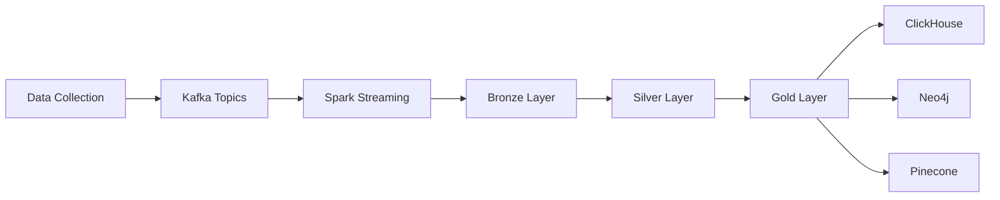

## What is the Entertainment Data Platform?

The **Entertainment Data Platform** is a high-performance data engineering ecosystem built to process and organize large-scale Movies, TV Series, and People data. It implements a Medallion Architecture (Bronze → Silver → Gold) powered by Delta Lake, effectively bridging the gap between raw, chaotic Kafka streams and specialized downstream applications.

<Note>
  The platform ensures data reliability through ACID transactions and optimizes performance using an **intelligent change-tracking mechanism**, ensuring updates to expensive Graph (Neo4j) and Vector (Pinecone) databases with high efficiency.
</Note>

## Core Objectives

The platform is designed with three primary objectives:

<CardGroup cols={3}>
  <Card title="Scalable Ingestion" icon="bolt">
    Handling high-velocity data with Spark Streaming and Kafka for real-time processing at scale
  </Card>
  <Card title="Data Reliability" icon="shield-check">
    Implementing Delta Lake for deduplication, schema integrity, and comprehensive audit trails
  </Card>
  <Card title="Multi-Model Delivery" icon="database">
    Powering OLAP analytics (ClickHouse), Relationship Mapping (Neo4j), and AI-driven RAG (Pinecone) from a single unified pipeline
  </Card>
</CardGroup>

## Key Use Cases

The Entertainment Data Platform enables several powerful use cases:

### Real-time Analytics
Leverage ClickHouse for ultra-fast OLAP capabilities, enabling statistical reporting and interactive dashboards on entertainment data.

### Knowledge Graph Exploration
Traverse deep relationships between Movies, TV Shows, and their respective Cast and Crew using Neo4j's graph database capabilities.

### AI-Powered Recommendations
Build semantic search and Retrieval-Augmented Generation (RAG) applications using Pinecone vector embeddings for intelligent content discovery.

### Data Quality & Auditing
Maintain immutable raw data storage with comprehensive lineage tracking through the Bronze layer for auditing and re-processing.

## Platform Features

<AccordionGroup>
  <Accordion title="High-Throughput Stream Processing">
    Leverages Spark Structured Streaming to ingest and validate data from Apache Kafka in real-time, handling high-velocity data streams efficiently.
  </Accordion>

  <Accordion title="Fault-Tolerant Ingestion (DLQ)">
    Features a built-in "Lightweight Parsing" mechanism. If critical fields cannot be parsed due to schema evolution or corruption, records are routed to a Dead Letter Queue (DLQ) on MinIO instead of halting the entire pipeline.
  </Accordion>

  <Accordion title="Medallion Architecture">
    - **Bronze Layer:** Immutable raw data storage for auditing and re-processing
    - **Silver Layer:** Cleaned and deduplicated data using Delta Lake's Upsert (Merge) logic, ensuring a "Single Source of Truth"
    - **Gold Layer:** Business-ready tables optimized for specific query patterns
  </Accordion>

  <Accordion title="Change-Driven Sync Logic">
    A sophisticated batch refinement process that detects changes in relationship or embedding-related fields. It ensures that downstream updates (Neo4j/Pinecone) only occur when data has actually changed, drastically reducing overhead and API costs.
  </Accordion>

  <Accordion title="Production-Ready Deployment">
    Seamlessly transitions from local development to scale-out production using Docker Compose and Kubernetes (K8s) manifests.
  </Accordion>
</AccordionGroup>

## Technology Stack

The platform leverages best-in-class technologies across the data engineering ecosystem:

| Category | Technologies |
| :--- | :--- |
| **Languages** | Python 3.10, SQL |
| **Data Ingestion** | Apache Kafka, Apache Spark 3.5.1 |
| **Orchestration** | Apache Airflow |
| **Storage & Delta** | Delta Lake 3.2.0, MinIO |
| **Databases** | ClickHouse, Neo4j, Pinecone |
| **Infrastructure** | Docker, Kubernetes |

## High-Level Architecture

The Entertainment Data Platform follows a layered architecture pattern:

1. **Data Collection & Ingestion**: Raw entertainment data is collected and published to Kafka topics
2. **Stream Processing**: Spark Structured Streaming consumes Kafka events and validates critical fields
3. **Bronze Layer**: Immutable raw data is stored in Delta Lake on MinIO
4. **Silver Layer**: Data is deduplicated and cleaned using Delta Lake ACID transactions
5. **Gold Layer**: Business-ready data is transformed and synced to specialized databases
6. **Serving Layer**: Data is available for analytics (ClickHouse), graph queries (Neo4j), and vector search (Pinecone)

For detailed architecture information, see the [Architecture](/architecture) page.

## Next Steps

<CardGroup cols={2}>
  <Card title="Quick Start" icon="rocket" href="/quickstart">
    Get the platform running locally in minutes
  </Card>
  <Card title="Architecture Deep Dive" icon="diagram-project" href="/architecture">
    Understand the complete system architecture and data flows
  </Card>
</CardGroup>